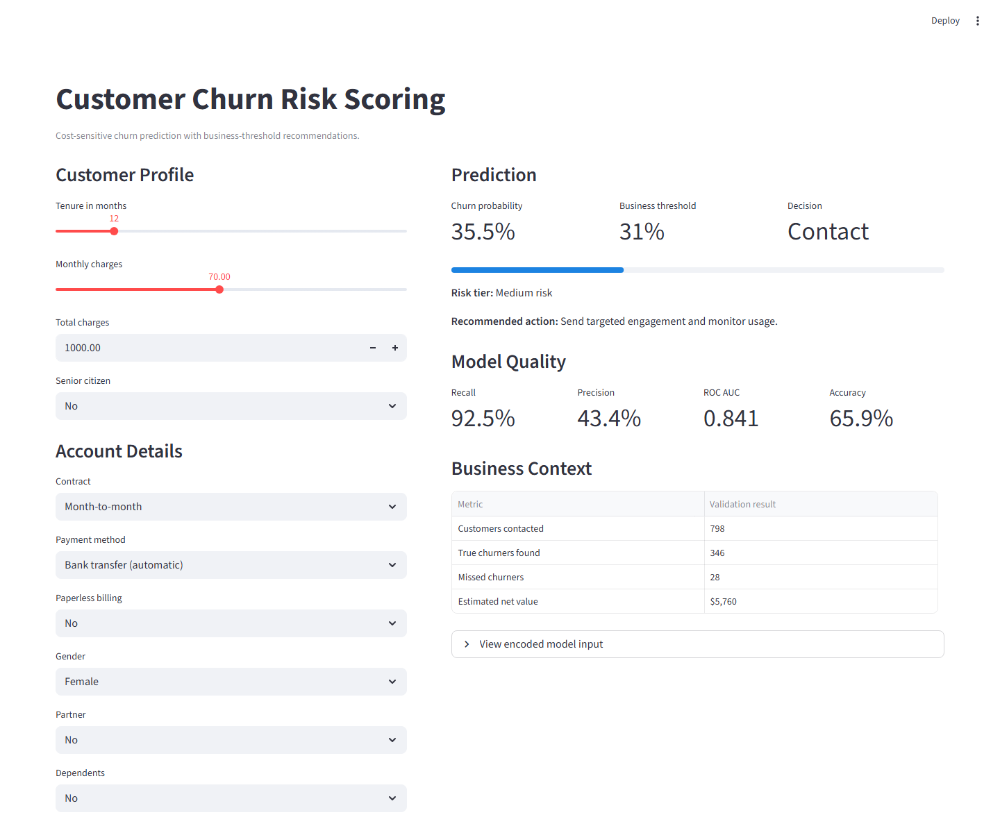

# Customer Churn Prediction and Retention Strategy

An end-to-end machine learning case study that predicts telecom customer churn and translates model scores into retention decisions. The project focuses on practical business tradeoffs: catching likely churners, choosing an operating threshold, and estimating campaign value.



## Why this project matters

Churn prediction is useful only when it supports an action. This project treats churn as a cost-sensitive decision problem instead of a plain accuracy contest. The model outputs a churn probability, applies a business threshold, assigns a risk tier, and recommends whether a customer should receive retention outreach.

## Project highlights

- Cleaned and modeled the Telco Customer Churn dataset with 7,043 customers.
- Removed identifier leakage by dropping `customerID` before training.
- Built a reproducible sklearn pipeline for imputation, scaling, one-hot encoding, and classification.
- Compared balanced Logistic Regression and Random Forest models.
- Tuned the prediction threshold using a simple retention ROI simulation.
- Packaged the final model in a Streamlit app for interactive churn scoring.

## Repository structure

```text
.
├── app.py
├── data/
│   └── telco_churn.csv
├── models/
│   ├── churn_pipeline.joblib
│   ├── churn_model.pkl
│   └── feature_columns.pkl
├── notebooks/
│   └── customer_churn_case_study.ipynb
├── reports/
│   └── model_metrics.json
├── scripts/
│   └── train_model.py
├── README.md
└── requirements.txt
```

## Modeling approach

The training script uses:

- `TotalCharges` numeric conversion with median imputation.
- Median imputation and scaling for numeric features.
- Most-frequent imputation and one-hot encoding for categorical features.
- Stratified train-test split to preserve the churn rate.
- Class-balanced models to improve recall on churned customers.
- A threshold search that selects the operating point with the best estimated retention value.

## Current validation results

Metrics are generated by `scripts/train_model.py` and saved to `reports/model_metrics.json`.

| Metric | Value |
| --- | ---: |
| Dataset rows | 7,043 |
| Churn rate | 26.5% |
| Selected model | Balanced Logistic Regression |
| Recall | 92.5% |
| Precision | 43.4% |
| ROC AUC | 0.841 |
| Business threshold | 31% |
| Estimated validation net value | $5,760 |

The selected threshold intentionally favors recall because missing likely churners is more expensive than contacting some customers who would have stayed.

## Run locally

Create an environment and install dependencies:

```bash
pip install -r requirements.txt
```

Retrain the model:

```bash
python scripts/train_model.py
```

Launch the app:

```bash
streamlit run app.py
```

## Deploy on Streamlit Community Cloud

1. Push this folder to a public GitHub repository.
2. Go to [share.streamlit.io](https://share.streamlit.io/) and sign in with GitHub.
3. Click **Create app**.
4. Choose the GitHub repository, select the `main` branch, and set the main file path to `app.py`.
5. Click **Deploy**. Streamlit will install dependencies from `requirements.txt` and serve the app on a public `streamlit.app` URL.

See [DEPLOYMENT.md](DEPLOYMENT.md) for the exact Git commands and settings.

## Resume summary

Built an end-to-end customer churn prediction system using Python, pandas, and scikit-learn; cleaned telecom subscription data, trained cost-sensitive models, optimized a retention threshold using ROI assumptions, and deployed an interactive Streamlit app for real-time risk scoring.

## Next improvements

- Add SHAP explanations for individual predictions.
- Add a model card with bias, limitations, and monitoring notes.
- Deploy the app publicly with Streamlit Community Cloud.
